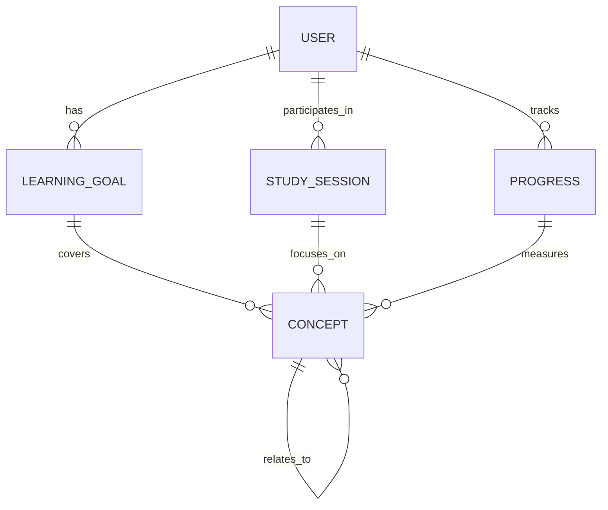

# 🏗️ Know-Flow Technical Architecture

## 📋 **Table of Contents**
1. [System Overview](#system-overview)
2. [Frontend Architecture](#frontend-architecture)
3. [Backend Architecture](#backend-architecture)
4. [AI Agent System](#ai-agent-system)
5. [Data Models](#data-models)
6. [API Design](#api-design)
7. [Security Architecture](#security-architecture)
8. [Deployment Architecture](#deployment-architecture)
9. [Performance Considerations](#performance-considerations)
10. [Scalability Strategy](#scalability-strategy)

---

## 🎯 **System Overview**

### **Architecture Principles**
- **Microservices-Ready**: Modular design for future scalability
- **AI-First**: Built around intelligent agents from the ground up
- **Real-Time**: Live data synchronization and updates
- **Progressive Enhancement**: Core functionality works without JavaScript
- **Mobile-First**: Responsive design optimized for all devices

### **Technology Stack Matrix**
| Layer | Technology | Purpose | Version |
|-------|------------|---------|---------|
| **Frontend** | React | UI Framework | 18.x |
| **Language** | TypeScript | Type Safety | 5.x |
| **Styling** | Tailwind CSS | Utility-First CSS | 3.x |
| **State Management** | React Context + Hooks | Local State | Built-in |
| **Backend** | Firebase | BaaS Platform | Latest |
| **Database** | Firestore | NoSQL Database | Latest |
| **Authentication** | Firebase Auth | User Management | Latest |
| **Hosting** | Firebase Hosting | Static Hosting | Latest |
| **AI Integration** | OpenAI API | LLM Services | Latest |

---

## 🎨 **Frontend Architecture**

### **Component Hierarchy**
```
App.tsx
├── AuthContext (Authentication State)
├── Layout.tsx (Main Layout Wrapper)
│   ├── Navigation
│   └── Main Content Area
├── Dashboard.tsx (Main Dashboard)
│   ├── LearningProgress
│   ├── RecentActivity
│   └── QuickActions
├── Auth Components
│   ├── Login.tsx
│   └── Signup.tsx
├── Learning Components
│   ├── StudyPlan.tsx
│   ├── LearningGoals.tsx
│   ├── ConceptExplorer.tsx
│   └── Quiz.tsx
└── Common Components
    ├── LoadingSpinner.tsx
    └── ErrorBoundary
```

### **State Management Strategy**
```typescript
// Centralized authentication state
interface AuthContextType {
  user: User | null;
  loading: boolean;
  signIn: (email: string, password: string) => Promise<void>;
  signInWithGoogle: () => Promise<void>;
  signOut: () => Promise<void>;
}

// Component-level state for UI interactions
interface ComponentState {
  isLoading: boolean;
  error: string | null;
  data: any;
}
```

### **Routing Strategy**
- **Client-Side Routing**: React Router for SPA navigation
- **Protected Routes**: Authentication-based access control
- **Dynamic Loading**: Code splitting for performance optimization
- **Deep Linking**: Direct access to specific learning content

---

## 🔧 **Backend Architecture**

### **Firebase Services Integration**
```typescript
// Service layer abstraction
interface FirebaseServices {
  auth: Auth;
  firestore: Firestore;
  storage: Storage;
  functions: Functions;
}

// Service initialization
const initializeServices = (): FirebaseServices => {
  const app = initializeApp(firebaseConfig);
  return {
    auth: getAuth(app),
    firestore: getFirestore(app),
    storage: getStorage(app),
    functions: getFunctions(app)
  };
};
```

### **Database Schema Design**
```typescript
// Core collections structure
interface DatabaseSchema {
  users: UserDocument[];
  learningGoals: GoalDocument[];
  studySessions: SessionDocument[];
  concepts: ConceptDocument[];
  progress: ProgressDocument[];
  chatMessages: MessageDocument[];
}

// Document interfaces
interface UserDocument {
  uid: string;
  email: string;
  displayName: string;
  learningPreferences: LearningPreferences;
  createdAt: Timestamp;
  lastActive: Timestamp;
}

interface LearningPreferences {
  preferredLearningStyle: 'visual' | 'auditory' | 'kinesthetic';
  difficultyLevel: 'beginner' | 'intermediate' | 'advanced';
  topicsOfInterest: string[];
  timeAvailability: number; // minutes per day
}
```

---

## 🤖 **AI Agent System**

### **Agent Architecture Pattern**
```typescript
// Base agent interface
interface BaseAgent {
  id: string;
  name: string;
  version: string;
  capabilities: AgentCapability[];
  
  // Core methods
  initialize(): Promise<void>;
  process(input: AgentInput): Promise<AgentOutput>;
  learn(feedback: AgentFeedback): Promise<void>;
  getStatus(): AgentStatus;
}

// Specialized agent implementations
class LearningIntelligenceAgent implements BaseAgent {
  async process(input: LearningContext): Promise<LearningRecommendation[]> {
    // AI-powered analysis and recommendation generation
    const analysis = await this.analyzeLearningPatterns(input);
    const recommendations = await this.generateRecommendations(analysis);
    return this.optimizeForUser(recommendations, input.userProfile);
  }
}

class ContentGenerationAgent implements BaseAgent {
  async process(input: ContentRequest): Promise<GeneratedContent[]> {
    // AI-powered content creation and adaptation
    const baseContent = await this.retrieveBaseContent(input.topic);
    const adaptedContent = await this.adaptForUser(baseContent, input.userProfile);
    return this.enhanceWithAI(adaptedContent, input.learningObjectives);
  }
}
```

### **Agent Communication Protocol**
```typescript
// Inter-agent communication
interface AgentMessage {
  from: string;
  to: string;
  type: 'request' | 'response' | 'notification';
  payload: any;
  timestamp: Date;
  correlationId: string;
}

// Agent orchestration
class AgentOrchestrator {
  private agents: Map<string, BaseAgent> = new Map();
  
  async coordinateRequest(request: UserRequest): Promise<CoordinatedResponse> {
    const learningAgent = this.agents.get('learning-intelligence');
    const contentAgent = this.agents.get('content-generation');
    
    // Coordinate multiple agents for complex requests
    const learningContext = await learningAgent.process(request);
    const content = await contentAgent.process({
      ...request,
      context: learningContext
    });
    
    return this.synthesizeResponse(learningContext, content);
  }
}
```

---

## 📊 **Data Models**

### **Core Entity Relationships**


### **Data Flow Architecture**
```typescript
// Real-time data synchronization
interface DataFlow {
  // User interactions trigger data updates
  userAction: UserAction;
  
  // Updates propagate through the system
  localUpdate: LocalStateChange;
  remoteSync: FirestoreUpdate;
  aiAnalysis: AIProcessing;
  
  // Results update the UI and trigger new recommendations
  uiUpdate: UIStateChange;
  newRecommendations: LearningRecommendation[];
}
```

---

## 🌐 **API Design**

### **RESTful Endpoints**
```typescript
// Authentication endpoints
POST /api/auth/signin
POST /api/auth/signup
POST /api/auth/signout
POST /api/auth/google

// Learning endpoints
GET /api/learning/goals
POST /api/learning/goals
PUT /api/learning/goals/:id
DELETE /api/learning/goals/:id

GET /api/learning/progress
POST /api/learning/sessions
GET /api/learning/recommendations

// AI endpoints
POST /api/ai/analyze-context
POST /api/ai/generate-content
POST /api/ai/optimize-path
```

### **GraphQL Schema (Future)**
```graphql
type User {
  id: ID!
  email: String!
  displayName: String!
  learningGoals: [LearningGoal!]!
  studySessions: [StudySession!]!
  progress: Progress!
}

type LearningGoal {
  id: ID!
  title: String!
  description: String!
  targetDate: DateTime!
  status: GoalStatus!
  concepts: [Concept!]!
}

type Concept {
  id: ID!
  name: String!
  description: String!
  difficulty: DifficultyLevel!
  relatedConcepts: [Concept!]!
  learningMaterials: [LearningMaterial!]!
}
```

---

## 🔒 **Security Architecture**

### **Authentication & Authorization**
```typescript
// Multi-factor authentication support
interface SecurityConfig {
  // Primary authentication
  primaryAuth: 'email-password' | 'google-oauth' | 'sso';
  
  // Additional security layers
  mfa: {
    enabled: boolean;
    methods: ('sms' | 'email' | 'totp')[];
  };
  
  // Session management
  session: {
    timeout: number; // minutes
    maxConcurrent: number;
    secureOnly: boolean;
  };
}

// Role-based access control
enum UserRole {
  STUDENT = 'student',
  INSTRUCTOR = 'instructor',
  ADMIN = 'admin',
  ENTERPRISE = 'enterprise'
}

interface Permission {
  resource: string;
  action: 'create' | 'read' | 'update' | 'delete';
  conditions: PermissionCondition[];
}
```

### **Data Protection**
```typescript
// Data encryption and privacy
interface DataProtection {
  // Field-level encryption
  sensitiveFields: string[];
  encryptionAlgorithm: 'AES-256' | 'ChaCha20';
  
  // Data anonymization
  anonymizationRules: AnonymizationRule[];
  
  // GDPR compliance
  dataRetention: {
    personalData: number; // days
    analyticsData: number; // days
    deletionPolicy: 'immediate' | 'scheduled';
  };
}
```

---

## 🚀 **Deployment Architecture**

### **Environment Configuration**
```typescript
// Environment-specific configurations
interface EnvironmentConfig {
  development: Config;
  staging: Config;
  production: Config;
}

interface Config {
  firebase: FirebaseConfig;
  openai: OpenAIConfig;
  analytics: AnalyticsConfig;
  monitoring: MonitoringConfig;
}

// Configuration management
class ConfigManager {
  private static instance: ConfigManager;
  private config: EnvironmentConfig;
  
  static getInstance(): ConfigManager {
    if (!ConfigManager.instance) {
      ConfigManager.instance = new ConfigManager();
    }
    return ConfigManager.instance;
  }
  
  getConfig(environment: string): Config {
    return this.config[environment] || this.config.development;
  }
}
```

### **CI/CD Pipeline**
```yaml
# GitHub Actions workflow
name: Deploy to Firebase
on:
  push:
    branches: [main, develop]
  pull_request:
    branches: [main]

jobs:
  test:
    runs-on: ubuntu-latest
    steps:
      - uses: actions/checkout@v3
      - uses: actions/setup-node@v3
      - run: npm ci
      - run: npm test
      - run: npm run build

  deploy:
    needs: test
    runs-on: ubuntu-latest
    if: github.ref == 'refs/heads/main'
    steps:
      - uses: actions/checkout@v3
      - uses: actions/setup-node@v3
      - run: npm ci
      - run: npm run build
      - uses: FirebaseExtended/action-hosting-deploy@v0
        with:
          repoToken: '${{ secrets.GITHUB_TOKEN }}'
          firebaseServiceAccount: '${{ secrets.FIREBASE_SERVICE_ACCOUNT }}'
          projectId: know-flow-487cd
```

---

## ⚡ **Performance Considerations**

### **Frontend Optimization**
```typescript
// Code splitting and lazy loading
const Dashboard = lazy(() => import('./components/Dashboard'));
const StudyPlan = lazy(() => import('./components/StudyPlan'));

// Memoization for expensive computations
const MemoizedProgressChart = memo(ProgressChart, (prevProps, nextProps) => {
  return prevProps.data === nextProps.data;
});

// Virtual scrolling for large lists
const VirtualizedConceptList = memo(({ concepts }: Props) => {
  return (
    <FixedSizeList
      height={400}
      itemCount={concepts.length}
      itemSize={50}
      itemData={concepts}
    >
      {ConceptRow}
    </FixedSizeList>
  );
});
```

### **Backend Optimization**
```typescript
// Database query optimization
interface QueryOptimization {
  // Indexing strategy
  indexes: DatabaseIndex[];
  
  // Query patterns
  commonQueries: QueryPattern[];
  
  // Caching strategy
  cacheLayers: CacheLayer[];
}

// Real-time updates optimization
class RealtimeOptimizer {
  private subscriptions: Map<string, Unsubscribe> = new Map();
  
  subscribeToUserData(userId: string): Unsubscribe {
    // Optimize real-time subscriptions
    const unsubscribe = onSnapshot(
      query(
        collection(db, 'users', userId, 'data'),
        where('updatedAt', '>', new Date(Date.now() - 24 * 60 * 60 * 1000))
      ),
      this.handleDataUpdate
    );
    
    this.subscriptions.set(userId, unsubscribe);
    return unsubscribe;
  }
}
```

---

## 📈 **Scalability Strategy**

### **Horizontal Scaling**
```typescript
// Microservices architecture preparation
interface ServiceDecomposition {
  // Core services
  userService: UserService;
  learningService: LearningService;
  aiService: AIService;
  analyticsService: AnalyticsService;
  
  // Communication patterns
  serviceMesh: ServiceMesh;
  loadBalancing: LoadBalancingStrategy;
  circuitBreakers: CircuitBreakerConfig;
}

// Database scaling
interface DatabaseScaling {
  // Read replicas
  readReplicas: number;
  
  // Sharding strategy
  sharding: {
    strategy: 'hash' | 'range' | 'list';
    shardKey: string;
    numberOfShards: number;
  };
  
  // Caching layers
  cacheStrategy: 'redis' | 'memcached' | 'in-memory';
}
```

### **Performance Monitoring**
```typescript
// Application performance monitoring
interface APMConfig {
  // Metrics collection
  metrics: {
    responseTime: boolean;
    throughput: boolean;
    errorRate: boolean;
    resourceUtilization: boolean;
  };
  
  // Alerting
  alerts: AlertRule[];
  
  // Tracing
  distributedTracing: boolean;
  samplingRate: number;
}

// Real-time monitoring dashboard
class PerformanceMonitor {
  private metrics: MetricsCollector;
  private alerts: AlertManager;
  
  async collectMetrics(): Promise<PerformanceMetrics> {
    const metrics = await this.metrics.collect();
    await this.analyzePerformance(metrics);
    return metrics;
  }
}
```

---

## 🔮 **Future Architecture Evolution**

### **Phase 2: Microservices Migration**
- **Service Decomposition**: Break monolith into focused services
- **API Gateway**: Centralized routing and authentication
- **Event-Driven Architecture**: Asynchronous communication between services
- **Container Orchestration**: Kubernetes deployment and scaling

### **Phase 3: Advanced AI Integration**
- **Custom ML Models**: Train domain-specific models
- **Real-Time Inference**: Edge computing for low-latency AI responses
- **Federated Learning**: Privacy-preserving model training
- **Multi-Modal AI**: Text, image, and audio processing

### **Phase 4: Enterprise Features**
- **Multi-Tenancy**: Isolated customer environments
- **Advanced Analytics**: Business intelligence and reporting
- **API Marketplace**: Third-party integrations
- **Compliance Tools**: GDPR, SOC2, HIPAA compliance

---

## 📚 **Additional Resources**

- **Architecture Decision Records**: `docs/architecture/decisions/`
- **API Documentation**: `docs/api/`
- **Deployment Guides**: `docs/deployment/`
- **Performance Benchmarks**: `docs/performance/`
- **Security Guidelines**: `docs/security/`

---

*This document is part of the Know-Flow project documentation. For questions or contributions, please refer to the main README.md file.*
